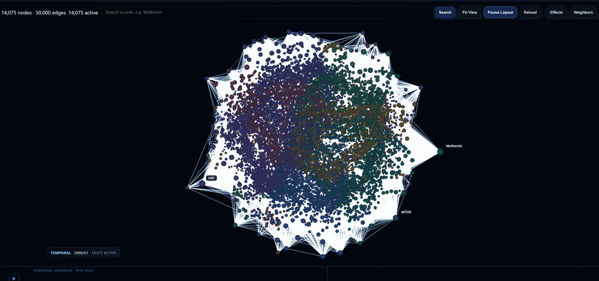

# Semantica Explorer

Semantica Explorer is the dashboard for the Semantica Knowledge Explorer. It pairs a Vite + React frontend with the FastAPI explorer backend to load a graph JSON file, expose it over `/api` and `/ws`, and render it as an interactive workspace for graph exploration, vocabulary browsing, reasoning, enrichment, decisions, and provenance.

In development, the frontend runs beside the Python backend on port `8000`. In production, the frontend build is written into `../semantica/static` so the backend can serve the compiled dashboard directly.



A quick pass through the Graph Explorer, the flagship surface inside the wider dashboard.

## How it works

The local development loop has three moving pieces:

1. Start the explorer backend with a graph JSON file.
2. The backend loads that graph into a `GraphSession` and exposes the explorer routes on `http://127.0.0.1:8000`.
3. Start the Vite frontend on `http://localhost:5173`; it proxies `/api` and `/ws` traffic to the backend and renders the live dashboard against that session.

If the dashboard opens but the graph stays empty, the problem is usually one of these:

- the backend is not running
- the backend was started without a valid graph file
- the frontend cannot reach `127.0.0.1:8000`

## What is in here

The dashboard is split into a few workspace-level surfaces:

- `Explore` is the main working area for the graph explorer and vocabulary browser.
- `Analyze` groups the SPARQL workspace and reasoning playground.
- `Decisions` is where decision chains and precedent review live.
- `Enrich` covers import/export and diff/merge workflows.
- `Manage` holds lineage and provenance views.

If you want the shortest path to the product, start with `Explore`. That is where the custom graph scene, loading overlay, effects pipeline, temporal controls, and local inspection flows live.

## Requirements

- Node.js 20+ and npm
- Python 3.8+
- A Semantica graph JSON file to load into the explorer backend

## Local setup

You need two terminals: one for the Python backend and one for the Vite dev server.

### 1. Install backend dependencies

From the repository root:

```bash
pip install -e ".[explorer]"
```

If you are doing active development and want the usual test and formatting tools as well:

```bash
pip install -e ".[dev,explorer]"
```

### 2. Install frontend dependencies

```bash
cd semantica-explorer
npm install
```

### 3. Start the explorer backend

From the repository root, point the backend at a graph JSON file:

```bash
python -m semantica.explorer --graph path/to/graph.json
```

Equivalent CLI entrypoint:

```bash
semantica-explorer --graph path/to/graph.json
```

By default the backend starts on `http://127.0.0.1:8000`.

Useful endpoints once it is running:

- API health: `http://127.0.0.1:8000/api/health`
- API docs: `http://127.0.0.1:8000/docs`

The backend also serves the realtime mutation websocket at `ws://127.0.0.1:8000/ws/graph-updates`.

### 4. Start the frontend

In a second terminal:

```bash
cd semantica-explorer
npm run dev
```

The frontend starts on `http://localhost:5173`.

Vite is configured to proxy:

- `/api` to `http://127.0.0.1:8000`
- `/ws` to `ws://127.0.0.1:8000`

If the dashboard loads but data is missing, the first thing to check is whether the backend is running and whether it was started with a valid graph file.

## Quick tour

Once both processes are up:

1. Open `http://localhost:5173`
2. Wait for the graph session to hydrate; the first strong signal is that the graph canvas and summary counters populate.
3. In `Explore`, search for a known node and click it to center it in the graph.
4. Use `Fit View`, the effects controls, or the temporal controls to confirm the graph scene is live and interactive.
5. Switch to the Vocabulary Browser to inspect the same session from the schema side.
6. Open `Analyze` to try a SPARQL query or test inference rules.
7. Visit `Manage` if you want to sanity-check lineage and provenance views.

The Graph Explorer is still the fastest sanity check for a new session:

- search for a node
- hit `Fit View`
- inspect a node or neighborhood
- toggle effects or temporal controls
- confirm the graph responds without requiring a reload

## Frontend commands

From `semantica-explorer/`:

```bash
npm run dev
npm run build
npm run preview
npm run test:graph-store
```

What they do:

- `dev` starts the Vite development server
- `build` runs TypeScript project builds and writes the production bundle to `../semantica/static`
- `preview` serves the built frontend locally
- `test:graph-store` runs the graph store regression test for multi-edge behavior

## Production build

The frontend is built into the backend's static directory:

```bash
cd semantica-explorer
npm run build
```

That produces the compiled assets in:

```text
../semantica/static
```

The FastAPI explorer app serves those assets and falls back to `index.html` for the SPA shell.

## Directory guide

Some useful entry points when you are working in this package:

- `src/App.tsx` for the top-level shell and workspace navigation
- `src/workspaces/GraphWorkspace/` for the graph explorer runtime
- `src/workspaces/VocabularyWorkspace/` for the vocabulary browser
- `src/workspaces/SparqlWorkspace/` for the SPARQL editor and results view
- `src/workspaces/DecisionWorkspace/` for decision review flows
- `src/workspaces/ImportExportWorkspace/` for import/export actions

## API and runtime notes

- The backend process is the source of truth for the active graph session.
- The frontend talks to the backend through the normal REST routes under `/api`.
- Realtime graph mutations flow through `/ws/graph-updates`.
- In local development, Vite proxies both `/api` and `/ws` so the browser can stay on `localhost:5173` while still talking to the backend on `127.0.0.1:8000`.

## Notes for contributors

- The frontend expects the backend contract exposed by `semantica.explorer.app`
- The graph workspace is performance-sensitive, when changing rendering or layout behavior, sanity-check both dense overview mode and active-node interaction
- If you change asset or chunking behavior, remember that the build output is committed into the backend static directory in this repository

## Related docs

- Root project overview: `../README.md`
- Python explorer entrypoint: `../semantica/explorer/__init__.py`
- FastAPI app factory: `../semantica/explorer/app.py`
